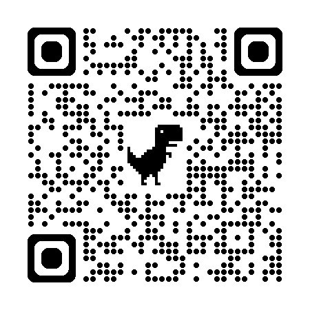
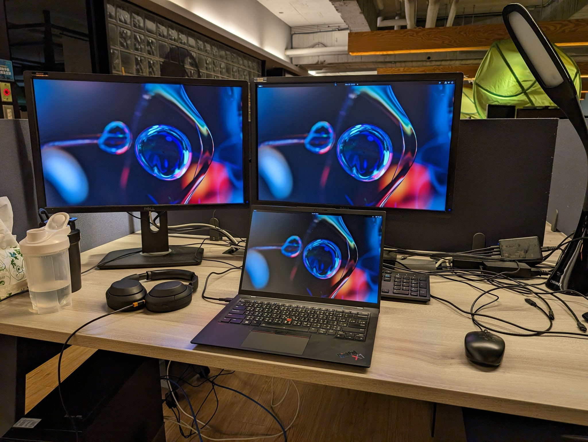
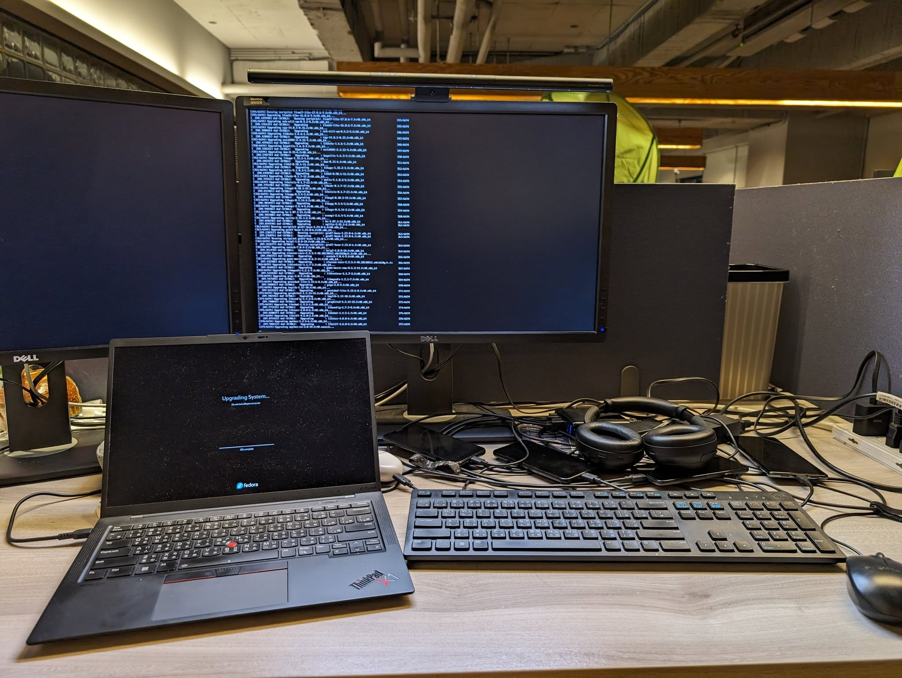

<!-- Google tag (gtag.js) -->

<!-- _paginate: false -->

# BenQ【即code救援 重返自由】實體集結｜台北站
## 重返自由 - 硬體讓你自由了，軟體也要自由！
 
 

## Denny Huang
### 2025/09/13 @BenQ 內湖總部

---

# [https://denny.one/20250913-BenQ-OSS](https://denny.one/20250913-BenQ-OSS)

---

# Denny Huang

- <a href="https://sitcon.org/" target="_blank">SITCON 學生計算機年會</a> 共同發起人
- <a href="https://coscup.org/" target="_blank">COSCUP 開源人年會</a> 長期志工
- <a href="https://hitcon.org/" target="_blank">HITCON 台灣駭客年會</a> 長期志工
- <a href="https://denny.one/" target="_blank">About me</a>

---

# 辦公室燈光

 

---

# ScreenBar Pro 很棒，推薦你也買一支

 

---

# 你聽過/用過以下的軟體嗎？
- Chromium/Gecko/WebKit
- Android
- Linux
- Visual Studio Code
- Blender
- OBS Studio
- VLC Media Player
- OpenSSL

---

<iframe width="780" height="500" src="https://www.youtube.com/embed/6NhyCXJU-IQ" frameborder="0" allowfullscreen></iframe>

  
     By Bit Blueprint / Jimmy Huang
  

---

# Free Software, Open Source, FLOSS
## [ref1](https://ossf.denny.one/tw/legal-column-list/508-2010-07-15-10-50-34) / [ref2](https://www.gnu.org/philosophy/free-software-for-freedom.html)

---

# [自由軟體是什麼？](https://www.gnu.org/philosophy/free-sw.zh-tw.html)

---

# 四大自由

- 依照你的想法執行該程式的自由，無論任何目的（自由之零）。
- 研究該程式如何運作的自由，並依照你的想法修改它以符合你的運算所需（自由之壹）。能存取程式的源始碼 (source code) 是這項自由的先決條件。
- 再次散布程式副本的自由，如此你就能幫助他人（自由之貳）。
- 將你修改過後的版本散布給他人的自由（自由之參）。如此你就有機會讓你的改善惠及社群整體。能存取源始碼是這項自由的先決條件。

---

# License
## [授權條款介紹 - OpenFoundry](https://ossf.denny.one/tw/licenses)
## [創用 CC 授權](https://tw.creativecommons.net/home-page/)

---

# Community
## [開源社群推廣目錄](https://hackmd.io/@SITCON/floss-community-list)

---

# Thanks for listening

 
 

###### 本投影片採用
 <a href="https://creativecommons.org/licenses/by-sa/4.0/deed.zh-hant" target="_blank">創用 CC「姓名標示-相同方式分享 4.0 國際」授權條款</a>釋出
 <a href="https://marp.app/" target="_blank">Marp</a> 製作
